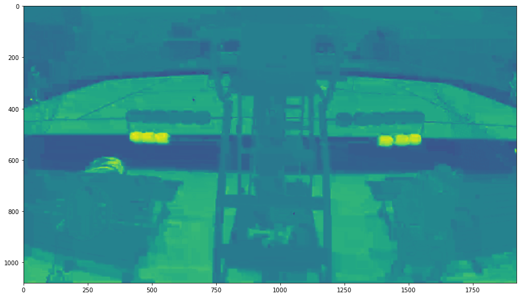
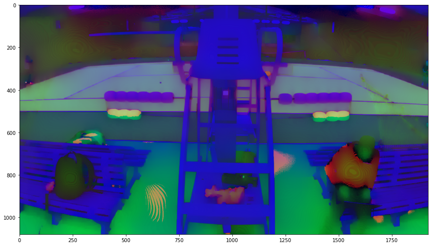
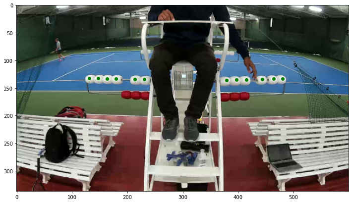

# Tennis_Camera

The goal of this test task is to track the score of a tennis game. We are given a set of video streams depicting a tennis court, in the middle of the frame we see the referee chair, to both sides of which there are red and white balls attached. Red balls correspond to sets, whereas the white ones - to individual scores. 

The task was performed with utilizing the OpenCV library in python. 
The solution went as following. 
First, there were image pre-processing performed. I began with a basic EDA to see the distribution of pixels in the image in different colorschemes, the later is important for masking. I based the object recognition on the colors. First, it was easy to detect the red objects because of the contrast. 

So I first segregated those from the image to then detect the white ones. The latter was more tricky, but I found a good way to do it with the use of the edgePreservingFilter that detected the difference between the background and contrasting cold white. 

Second, I drew the contours for each object and defined the centers, which are what the tracking is based on. Making sure that all the objects (12 white balls and 6 red balls) get detected with every frame analyzed, I was calculating the distances between the previous position of the ball and the current one for each detected frame. The frequency of this camera is around 83 frames per second, and I was analyzing every 40th frame - so every half a second. 

Finally, I was looping through the frames in the video stream and recording the change in scores. 

The current implementation is sensitive to the lighting and can recognize well-lit objects. Future implementations can be optimized for the memory and execution time - by parallelizing the loop. Also, for a more sophisticated model, I am planning to implement shape-based object recognition, which will be less sensitive to initial setting of the camera. 

All the written modules were combined into the Sport_Camera_Modules file.
